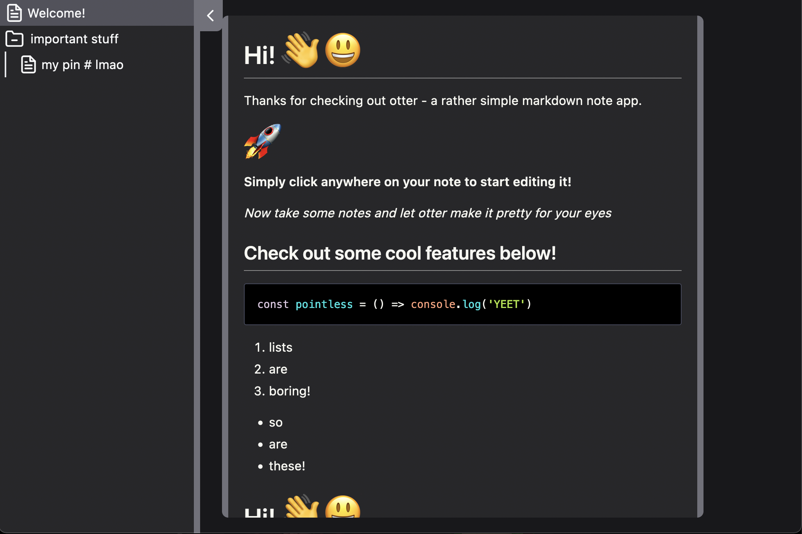

# 🦦 Otter

Otter is a simple Markdown note taking app. 



> [Check it out here →](https://otter-phi.vercel.app/)

## 🚀 Run it locally

```sh
yarn
yarn dev
# or swap out for whatever you like! (npm / pnpm)
```

## 🛠️ Tools

[Svelte](https://svelte.dev/)
[TypeScript](https://www.typescriptlang.org/)
[TailwindCSS](https://tailwindcss.com/)
[Vite](https://vitejs.dev/)
[Vercel](https://vercel.com/)

